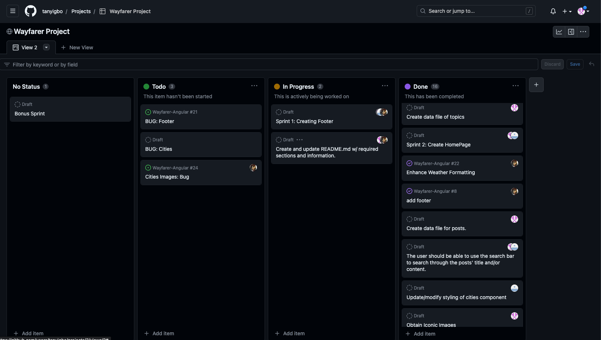
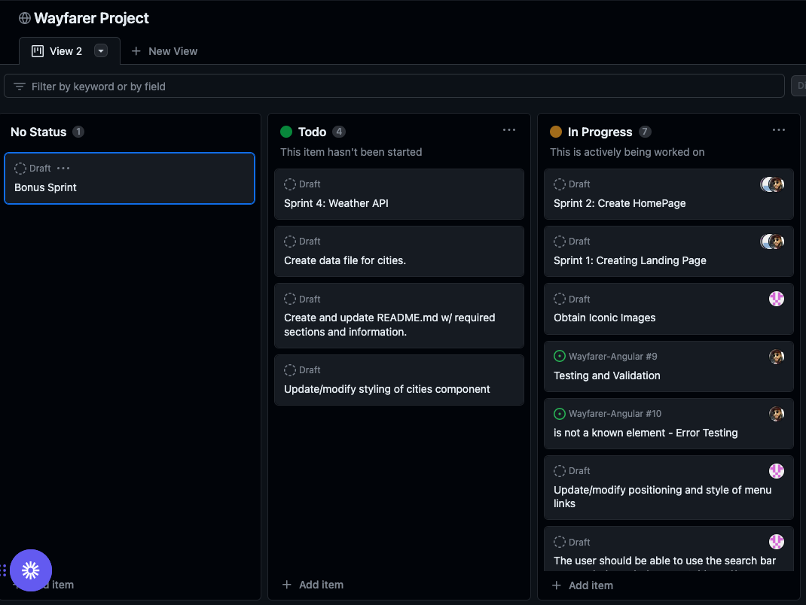

# Project Wayfarer:  A Travel Community Application

A travel community application to share sightseeing around their favorite locations.

  # Table of Contents
- [Project Overview](#project-overview)
- [Project Planning](#project-planning)
- [User Stories](#user-stories)
- [Installation](#installation)
- [Contribution](#contributing)
- [Wins & Hurdles](#wins--hurdles)
- [Technologies Used](#technologies-used)
- [Credits](#credits)

## Project Overview
Our team concurred to build a community travel application aimed at creating a platform where users can share city-specific tips, experiences, and recommendations. Whether it's a hidden gem, a must-visit landmark, a local restaurant, or a unique cultural experience, this app allows travelers to discover and contribute valuable information about their favorite locations around the world.

Once you follow the installation instructions to interact with the application via your browser, you are greeted with an enthusiastic recreational vehicle on the homepage.  From the 'Menu' option on the toolbar, you can click on the 'Cities' menu option.  From the 'Cities' page you can view an iconic picture of that city, current weather conditions, view and access shared city's post, with the newest post first.  To access a specific post to view the post's author, title and content, just click that post's title to view on the 'Show' post page.  You will be able to navigate back 'Home' or 'Cities' page via the menu on the toolbar.

Also, from the 'Cities' page you will be able to search all posts for a specific city when you type in the 'Search City's Post' section on the toolbar.

## Project Planning
   
   

## User Stories 
#### <ins>Sprint 1: Landing Page</ins>
<ol>
  <li>As a user, I should to be able to navigate to "/" and see a basic splash page with the name of the website.</li>
  <li>As a user, I should to be able to see the site-wide header on every page with a link to home page with list of cities.</li>
</ol>

#### <ins>Sprint 2: Home Page</ins>
<ol>
  <li>As a user, I should to be able to view the "San Francisco" page (at "/cities/1") including:</li>
    <ul>
      <li>The site-wide header.</li>
      <li>The name of the city.</li>
      <li>An iconic photo of the city</li>
    </ul>
  <li>As a user, I should to be able to view a list of posts on the San Francisco page:</li>
    <ul>
      <li>Sorted by newest first.</li>
      <li>With the post titles linked to the individual post "show" pages.</li>
    </ul>
  <li>As a user, I should to be able to use the search bar to search through the posts' title and/or content.</li>
  <li>As a user, I should to be able to click on the title of one of their posts and be redirected to a "show" page for that post.</li>
  <li>As a user, I should to be able to view post "show" pages with title, author, and content.</li>
</ol>

#### <ins>Sprint 3: Validations</ins>
<ol>
  <li>As a user, I should to be able to view city pages for "London" and the available cities.</li>
  <li>As a user, I should to be able to only see a post's title having a length between 1 and 200 characters.</li>
  <li>As a user, I should to be able to see post's content which are not empty.</li>
</ol>

#### <ins>Sprint 4: Weather API</ins>
  1. As a user, I should be able to view each selected cities current day's weather conditions via a call to the [Open Weather API](https://openweathermap.org/current) on the city's page.
  
## Wins & Hurdles
<ins>Wanda Avery</ins> - Implementing the 'Search City's Post' feature:  Learning a little more about observers, observable, and subject (RxJs) components. This was needed to get the two components to communicate through a shared service.  Then getting the correct data to view/show in the component once the filtered results returned or not and then show the initial set of posts once text was removed.  Thanks to Tobe, the feature was implemented as seen in the application.

## Technologies Used
- Angular
- TypeScript
- Material UI
- HTML/CSS
- Open Weather API

## Installation
1. From the command line, create a local directory where this repo will be cloned.
1. Clone this repository: `git clone <repository-url>`
1. Once cloned, navigate to the directory/folder and install the necessary dependencies from the terminal: `npm install`
1. Run the application from that directory/folder from the terminal: `ng serve`
1. Access the application in your browser at `http://localhost:4200`.

## Contributing
We welcome contributions from the community to enhance the Travel Community App. If you have any ideas, bug fixes, or improvements, please submit a pull request. Make sure to follow the existing code style and guidelines. You can also create new issues to report bugs or suggest new features.

## Credits 
We appreciate the time and effort follow developers put into making suggestions and code snippets available on [Stack Overflow](https://stackoverflow.com/) regarding anything Angular.

We are thankfull and appreciative for the awesome articles and pictures of the vairies cities:
[World Wide Honey](https://worldwidehoneymoon.com/seattle-3-day-itinerary-weekend-trip-to-seattle/) 
[Nomadic Matt](https://www.nomadicmatt.com/travel-guides/united-states-travel-guide/seattle/) 
[freepik](https://www.freepik.com/free-photo/montreal-river-sunset-with-city-lights-urban-buildings_29452819.htm#query=seattle%20city&position=4&from_view=keyword&track=ais) 
[istock](https://www.istockphoto.com/photo/union-jacks-on-oxford-street-for-the-queens-platinum-jubilee-gm1399934799-453662293?utm_source=unsplash&utm_medium=affiliate&utm_campaign=srp_photos_top&utm_content=https%3A%2F%2Funsplash.com%2Fs%2Fphotos%2Flondon&utm_term=london%3A%3A%3A) 

## Contact
We appreciate your interest in the Travel Community App.  If you have any questions and/or feedback, please reach out to the project team at :
- [Tobe Anyigbo](https://www.linkedin.com/in/tobe-anyigbo-a29b5173)
- [Wanda Avery](https://www.linkedin.com/in/wanda-simien-avery-48588a1bb)
- [Gene Brown]()

## License

This project is licensed under the [MIT License](LICENSE). Feel free to modify and distribute the code as needed.