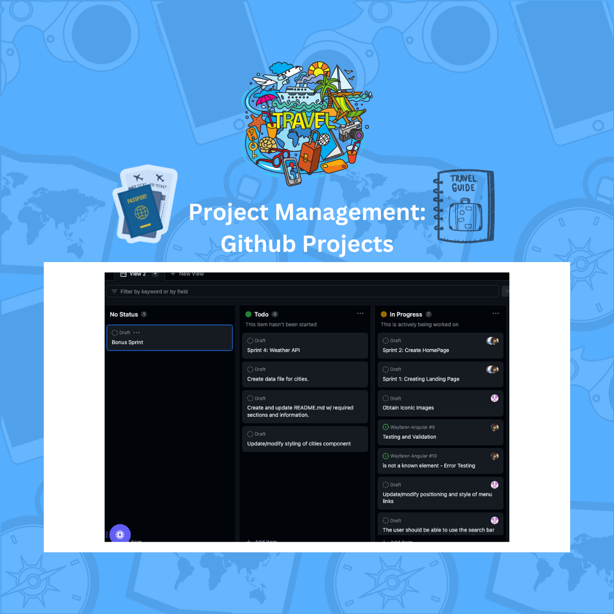
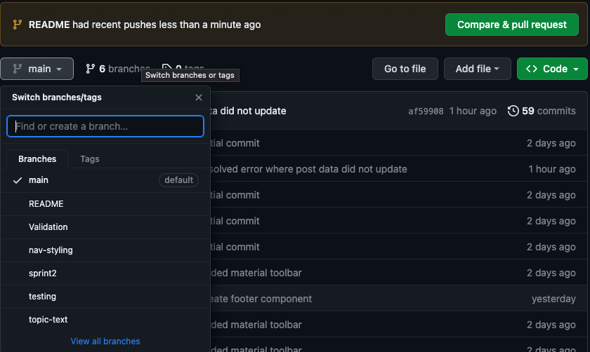
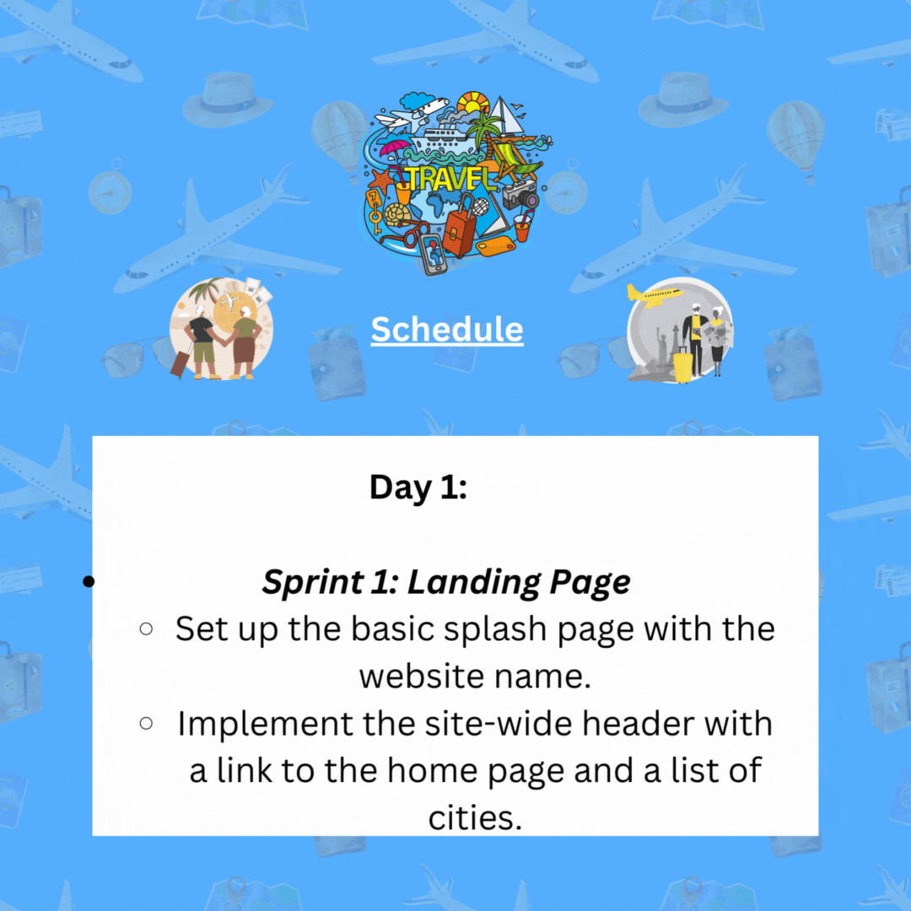
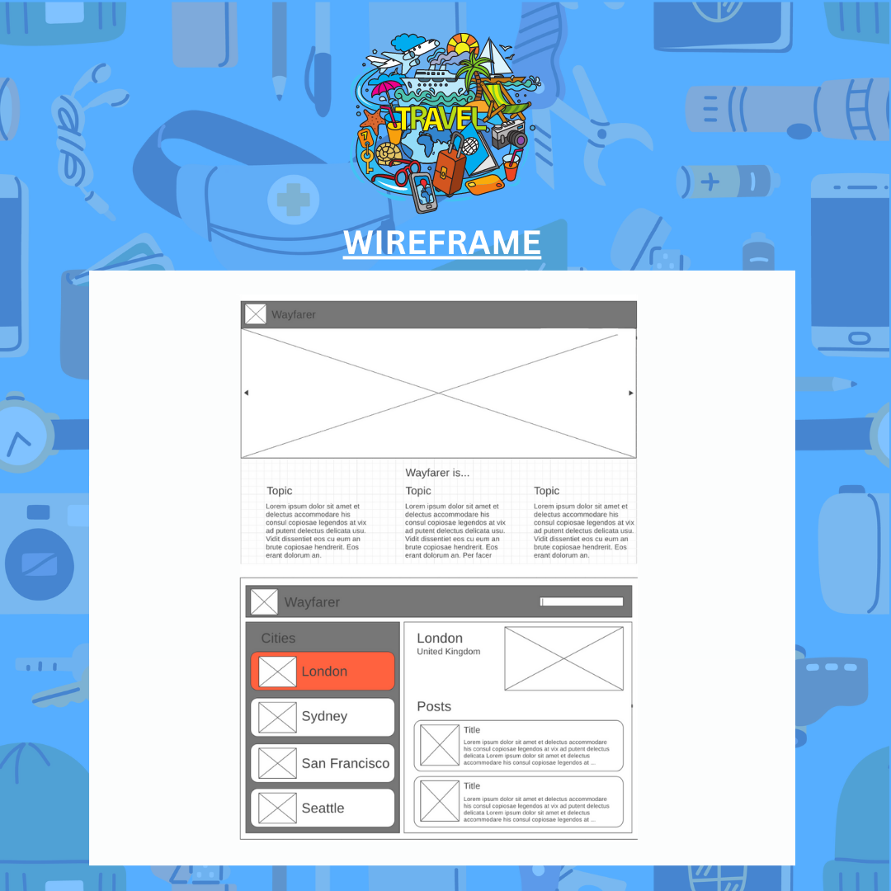
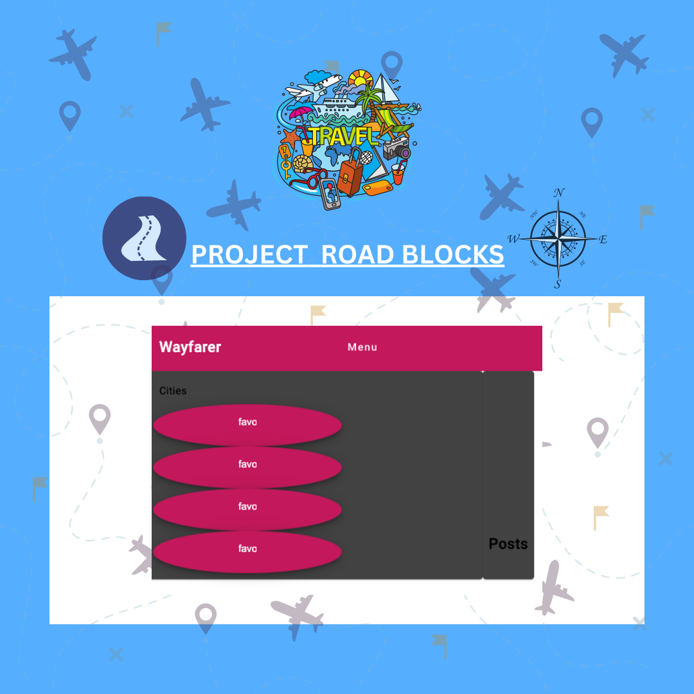
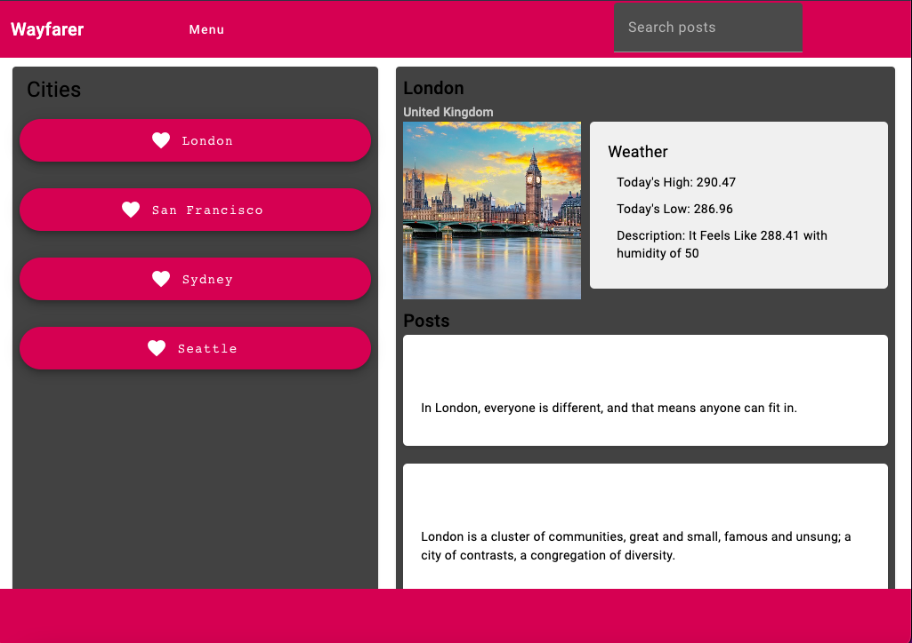

# Wayfarer Travel App

The Wayfarer Travel App is a group project aimed at creating a platform where users can share city-specific tips, experiences, and recommendations. 

Whether it's a hidden gem, a must-visit landmark, a local restaurant, or a unique cultural experience, this app allows travelers to discover and contribute valuable information about their favorite locations around the world.

## Features

- Search Functionality: Users can search for specific cities and posts to find relevant information quickly.

## General Approach 
1. Project Management: Kanban Board

2. Collaboration

3. Clear Goals and Objectives
4. Roles and Responsibilities 
5. Effective Communication
6. Continuous Learning
7. Code Reviews and Quality Assurance

## Planning Documentation 

### Schedule

### User Stories
####  📌 Sprint 1: Landing Page

As a user, I want to be able to navigate to the website's landing page ("/") and see a basic splash page displaying the name of the website.

As a user, I expect to see a site-wide header on every page with a link to the home page and a list of cities.

#### 📌 Sprint 2: HomePage

As a user, I want to view the "San Francisco" page ("/cities/1") which includes the site-wide header, the city name, and an iconic photo of the city.

As a user, I want to see a list of posts on the San Francisco page, sorted by newest first, with the post titles linked to individual post "show" pages.

As a user, I need the ability to use the search bar to search through the titles and content of the posts.

As a user, I should be able to click on the title of a post and be redirected to a "show" page to view the details of that post.

#### 📌 Sprint 3: Validations

As a user, I should be able to view city pages for "London" and "Gibraltar".

As a user, I expect the post title to have a minimum length of 1 character and a maximum length of 200 characters.

As a user, I want to ensure that a post's content cannot be empty.

#### 📌 Sprint 4: Weather API

As a user, I want the website to call the Open Weather API for each city to display the current weather on each city's page.

### 📐 Wireframe

### Angular Component Architecture

## ❌ Hurdles & Issues 

We had some minor disagreements and bug validation errors which were overcome by collaborating effectively and understanding that as a team, Communication is key and we have to communicate constantly and efficiently to accomplish anything. 

## 🔧 Tools and Technologies 
The following technologies and tools are used in this project:

- Angular
- TypeScript
- HTML/CSS
- Weather API

## 🔨 Tech Stack

  
  
  &nbsp;
  &nbsp;
  &nbsp;
  &nbsp;
  &nbsp;
  
  &nbsp;
  
  

 

## 📖 Getting Started

## Installation
To run the Travel Community App locally, follow these steps:

1. Clone the repository: `git clone <repository-url>`
2. Install the necessary dependencies: `npm install`
3. Run the app locally: `ng serve`
4. Access the app in your browser at `http://localhost:4200`.

## 💻 Usage 

## 👥 Contributing

We welcome contributions from the community to enhance the Travel Community App. If you have any ideas, bug fixes, or improvements, please submit a pull request. 

Make sure to follow the existing code style and guidelines. You can also create new issues to report bugs or suggest new features.

## 📝 References 

## 🔐 License

This project is licensed under the [MIT License](LICENSE). Feel free to modify and distribute the code as needed.

## 📧 Contact

If you have any questions or feedback, please reach out to the project team at :
- [Gene]()  

- [Tobe]() 
- [Wanda]()

We appreciate your interest in the Travel Community App and look forward to building an amazing travel community together!

For more Angular Specific Information for Testing and Version Information, Please visit [THIS PAGE](angular-setup.md)

